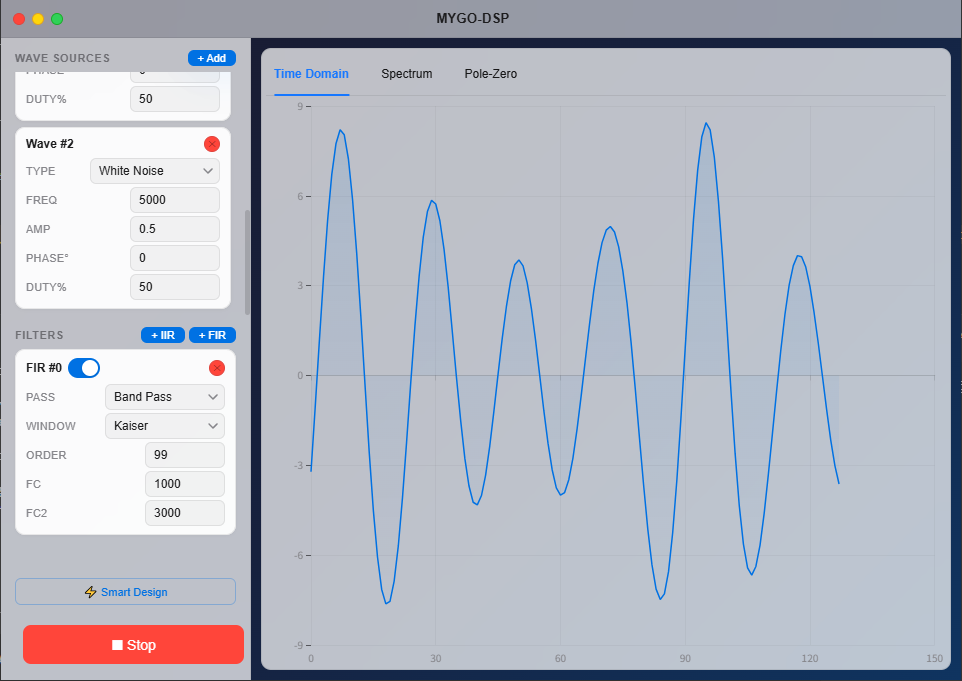
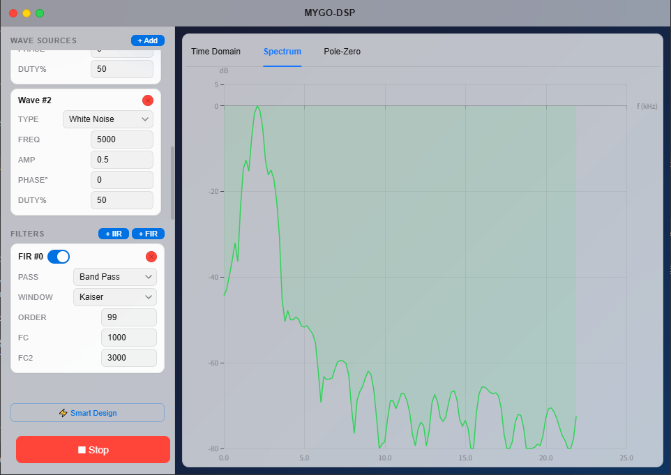
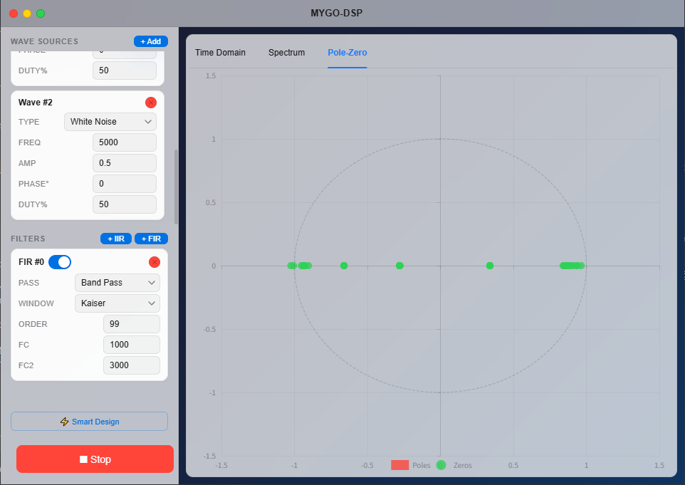

# MYGO-DSP — Modular Yielding Graphical Operators

<div align="center">

[](https://en.cppreference.com/w/cpp/17)
[](https://www.electronjs.org/)
[](https://react.dev/)

Real-time Digital Signal Processing & Filter Design Platform

</div>

---

<details>
<summary><strong>🇬🇧 English</strong></summary>
<br>

### 📷 Screenshots

| Time Domain | Spectrum | Pole-Zero |
|---|---|---|
|  |  |  |

### 📌 Overview

MYGO-DSP is an enterprise-grade digital signal processing and filter design platform built with C++17, Electron, and React.

- **C++ DSP Engine**: 7 waveform types, FIR/IIR filtering, auto filter designer
- **IPC Protocol**: stdin/stdout JSON line protocol
- **Desktop UI**: macOS Big Sur style, Electron + React 19 + ECharts

### ✅ Features

| Module | Capabilities |
|--------|-------------|
| Waveform Gen | Sine/Square/Triangle/Sawtooth/WhiteNoise/PinkNoise/Pulse |
| Real-time Control | Freq(1-96kHz), Amplitude, Phase, Duty Cycle, Multi-waveform mix |
| FIR Filter | 5 windows × 4 types (LP/HP/BP/BS), order 1-200 |
| IIR Filter | 6 prototypes + 9 RBJ biquads, order 1-20 |
| Smart Design | Auto prototype selection + order estimation |
| Real-time Analysis | Time domain, FFT spectrum, pole-zero plot |

### 🔧 Quick Start

#### Prerequisites

| Tool | Version |
|------|---------|
| CMake | ≥ 3.16 |
| MinGW/GCC | ≥ 8.1 (C++17) |
| Node.js | ≥ 18 |

#### Build & Run

```bash
# Build C++ engine
cd dsp-core
mkdir build && cd build
cmake .. -G "MinGW Makefiles"
mingw32-make -j4

# Run frontend
cd frontend
npm install
npx electron .
```

### 📁 Project Structure

```
MYGO-DSP/
├── dsp-core/          # C++17 DSP engine (~2500 lines)
├── frontend/          # Electron + React frontend
└── report/            # Development report (LaTeX, 99 pages)
```

### 📊 Performance

| Test | Throughput |
|------|-----------|
| Waveform Gen | 18.9M samples/s |
| IIR order=4 | 45.4M samples/s |
| FIR order=64 | 3.1M samples/s |
| Full Pipeline | 23,928 frames/s |

### 📄 License

MIT License. See [LICENSE](LICENSE).

</details>

<details>
<summary><strong>🇨🇳 中文</strong></summary>
<br>

### 📷 界面预览

| 时域波形 | 频谱图 | 零极点图 |
|---------|--------|---------|
|  |  |  |

### 📌 项目简介

MYGO-DSP 是一个基于 C++17 + Electron + React 的企业级数字信号处理与滤波器设计平台。

- **C++ DSP 引擎**: 7 种波形、FIR/IIR 滤波、自动滤波器设计
- **IPC 通信**: stdin/stdout JSON 行协议
- **桌面 UI**: macOS Big Sur 风格，ECharts 可视化

### ✅ 核心特性

| 模块 | 功能 |
|------|------|
| 波形发生器 | 正弦/方波/三角/锯齿/白噪声/粉红噪声/脉冲 |
| 实时控制 | 频率(1-96kHz)、幅度、相位、占空比、多波形叠加 |
| FIR 滤波 | 5种窗函数 × 4种类型，阶数 1-200 |
| IIR 滤波 | 6种原型 + 9种RBJ，阶数 1-20 |
| 智能设计 | 自动原型选择 + 阶数估算 |
| 实时分析 | 时域波形、FFT频谱、零极点图 |

### 🔧 快速开始

#### 前置要求

| 工具 | 版本 |
|------|------|
| CMake | ≥ 3.16 |
| MinGW/GCC | ≥ 8.1 (C++17) |
| Node.js | ≥ 18 |

#### 编译与运行

```bash
# 编译 DSP 引擎
cd dsp-core
mkdir build && cd build
cmake .. -G "MinGW Makefiles"
mingw32-make -j4

# 运行前端
cd frontend
npm install
npx electron .
```

### 📁 项目结构

```
MYGO-DSP/
├── dsp-core/          # C++17 DSP 引擎 (~2500行)
├── frontend/          # Electron + React 前端
└── report/            # 开发报告 (LaTeX, 99页)
```

### 📊 性能

| 测试项 | 吞吐量 |
|--------|--------|
| 波形生成 | 18.9M 样本/秒 |
| IIR order=4 | 45.4M 样本/秒 |
| FIR order=64 | 3.1M 样本/秒 |
| 完整管线 | 23,928 帧/秒 |

### 📄 许可

MIT License

---

</details>

<div align="center">
  <sub>Copyright © 2026 M45hiro. MIT License.</sub>
</div>
